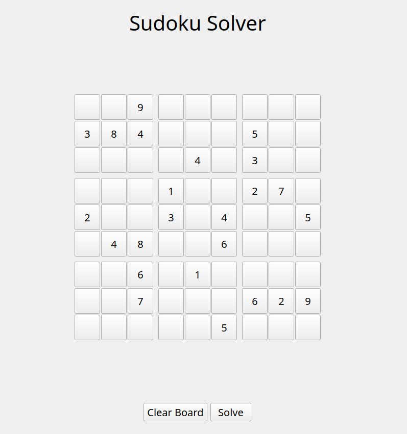

# Sudoku Solver
This is my implementation of a sudoku puzzle solver, with preset puzzles and custom puzzle solving. Relies on pruning possible board states, and branching when pruning becomes redundant.

  

## Instructions
Run `__main__.py` in the terminal, it will open in a seperate window. Click to select a tile, enter a number to change the value, and press backspace to remove a value. Then press solve!

## TODO:
- Add an actual functioning GUI lol.
- Optimise board searching (i.e reduce redundant searches with human-derived algorithms).
